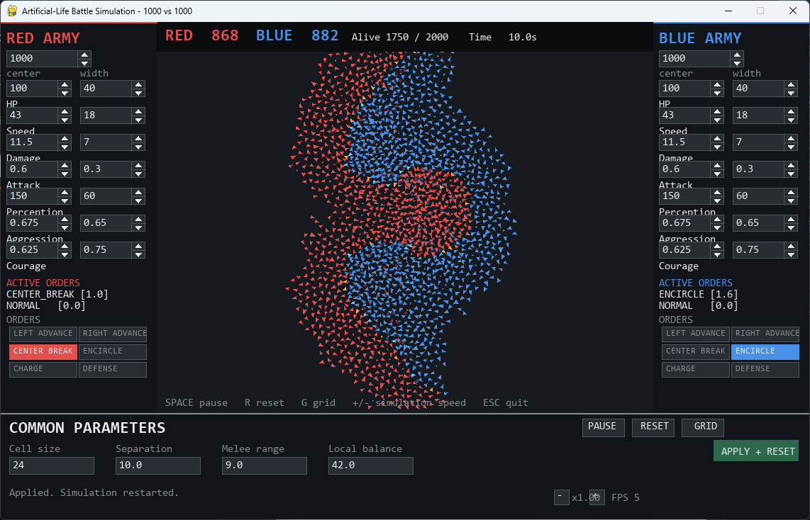
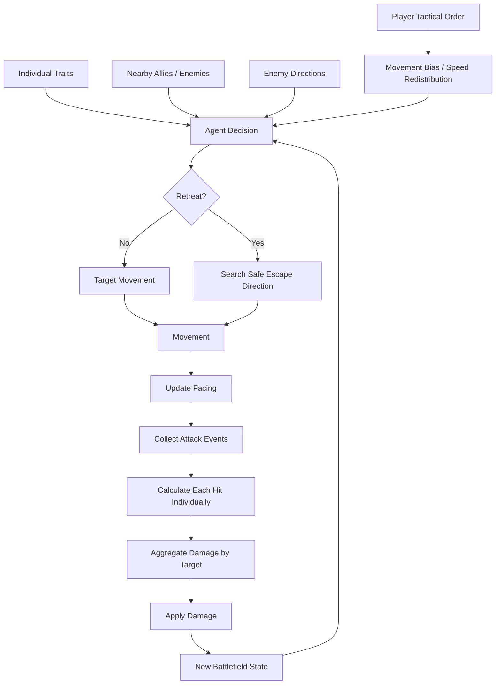
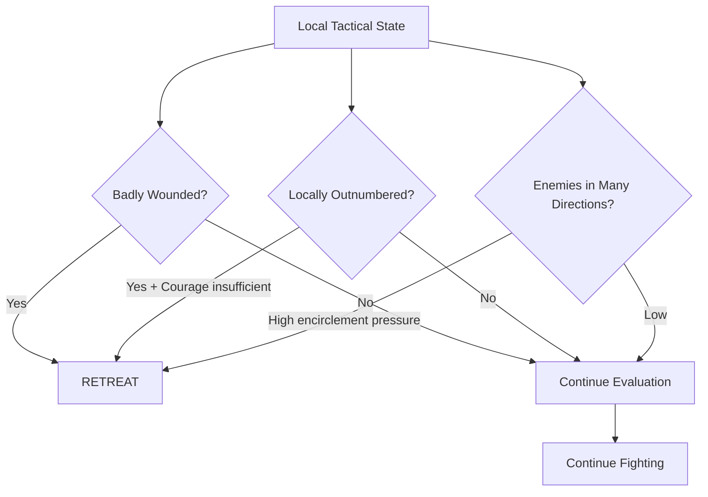
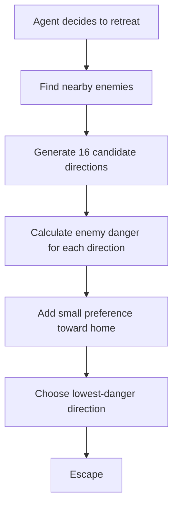
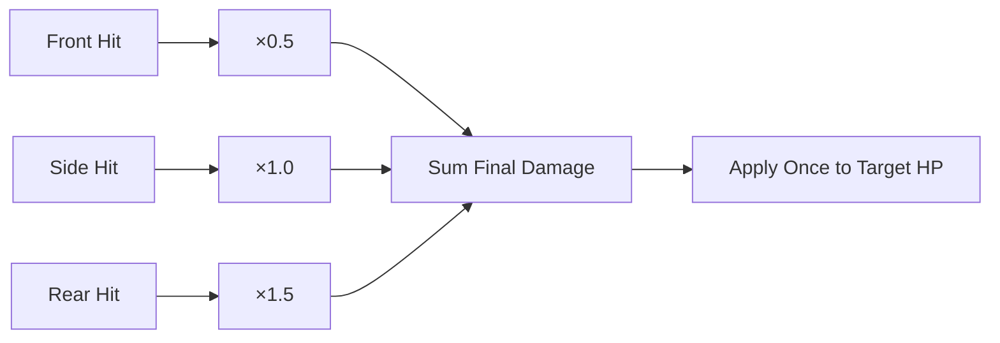
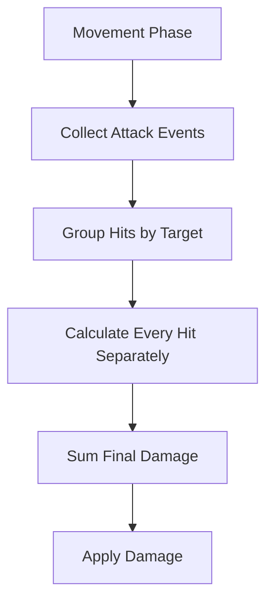
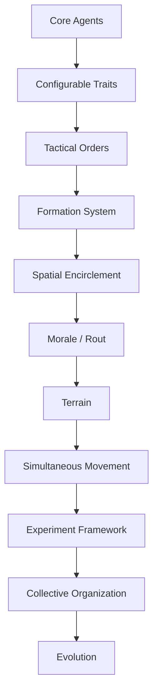
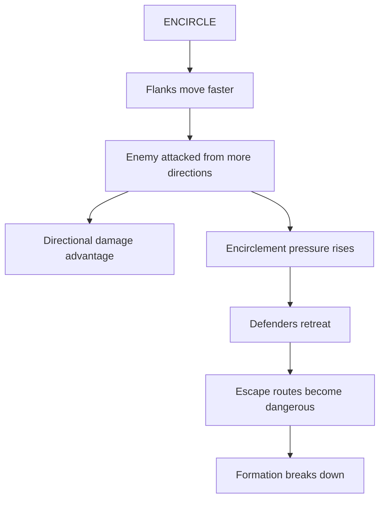

# AlifeBattle

AlifeBattle is a real-time artificial-life-style battle simulation written in Python and Pygame.

Thousands of autonomous soldiers fight using individual traits and local information. The player does not directly control individual units. Instead, the player gives temporary high-level orders such as **Left Advance**, **Center Break**, **Encircle**, **Charge**, and **Defense**, while each agent continues making its own decisions.

> **Core idea:** Tactical advantages should emerge from movement, positioning, local numerical superiority, facing, and agent behavior rather than from arbitrary command bonuses.

## Screenshot



The main screen consists of:

| Area | Purpose |
|---|---|
| Left panel | RED army size, traits, and tactical orders |
| Center | Real-time battlefield |
| Right panel | BLUE army size, traits, and tactical orders |
| Bottom panel | Shared simulation parameters and controls |

# What's New

This section compares the current version with the README version **before the previous README update**.

The changes below are therefore cumulative changes introduced across the recent development cycle.

| Added / Changed | Earlier Version | Current Version |
|---|---|---|
| **ARMOR** | No individual defense trait | Every agent has individual damage reduction |
| **Trait names** | `Speed`, `Damage`, `Attack` | `MOVE SPEED`, `ATTACK POWER`, `ATTACK INTERVAL` |
| **LEFT / RIGHT ADVANCE** | Small speed bonus | Main wing ×1.50, opposite wing ×0.70 |
| **CENTER BREAK** | Small center bonus | Center ×1.50, wings ×0.70 |
| **ENCIRCLE movement** | Mainly directional bias | Flanks ×1.40, center ×0.60 |
| **Encircle center behavior** | Most units could receive flank influence | Center receives no encircle movement vector |
| **Initial formation** | One rectangular block | Three-band formation by default |
| **Formation architecture** | Single spawn method | Generic formation definitions with `THREE_BAND` and `SINGLE_BLOCK` |
| **Formation control** | Agents only inherited their spawn position | Persistent unit IDs and local slots follow independently moving formation anchors |
| **Combat phase** | Attack closely coupled to agent update | Attacks collected and damage resolved in a later phase |
| **Multi-hit directional damage** | Attack directions combined before damage calculation | Each hit gets its own Front / Side / Rear calculation |
| **Encirclement detection** | Only nearby ally/enemy counts | Enemy directions divided into 8 sectors |
| **Encirclement pressure** | Surrounding direction had no effect | Multi-direction pressure increases retreat tendency |
| **Escape behavior** | Retreat mainly away from target / toward home | Retreating agents search 16 possible escape directions |
| **Blocked retreat** | Retreat ignored enemy distribution | Agents prefer locally safer escape gaps |
| **Local tactical state** | Ally/enemy count only | Allies, enemies, enemy directions, encirclement ratio |
| **Strength visualization** | Seven traits | ARMOR is included as the eighth trait |

## Most Important New Mechanic: Encirclement

The largest change is that **encirclement now has consequences even without a direct "Encircle damage bonus."**

Previously:

```text
ENCIRCLE
↓
Flank troops move around the enemy
↓
Position changes
```

Now:

```text
ENCIRCLE
↓
Flank troops move around the enemy
↓
Enemies appear in multiple directions
↓
Encirclement ratio increases
↓
Defenders become more likely to retreat
↓
They search for an escape gap
↓
If exits are blocked, retreat becomes difficult
↓
Side / rear attacks become more likely
```

This follows the project's central design principle:

> **ENCIRCLE itself does not grant extra damage. The spatial situation created by encirclement creates the advantage.**

# Simulation Overview



# Current Features

| Category | Current Implementation |
|---|---|
| Scale | 1,000 vs. 1,000 agents by default |
| Individual variation | 8 randomized traits |
| Formation | Three-band formation by default |
| Targeting | Local nearest-enemy acquisition |
| Spatial interaction | Spatial grid |
| Movement | Pursuit, separation, retreat, tactical commands |
| Facing | Persistent directional orientation |
| Combat | Melee attacks with cooldown |
| Directional combat | Front / Side / Rear damage |
| Defense | ARMOR + facing + stance |
| Local analysis | Allies, enemies, attack directions |
| Encirclement | 8-direction sector analysis |
| Retreat | HP, Courage, numerical disadvantage, encirclement |
| Escape | 16-direction safety search |
| Maneuvers | Left Advance, Right Advance, Center Break, Encircle |
| Stances | Charge, Defense |
| Configuration | Independent RED / BLUE parameters |
| Orders | Temporary tactical turns |

# Agent Traits

Each soldier is an independent `Agent`.

Traits are generated independently from the configured range when a battle begins.

| Display Name | Internal Name | Default Range | Meaning |
|---|---|---:|---|
| HP | `max_hp` | 80–120 | Total health |
| MOVE SPEED | `speed` | 34–52 | Base movement velocity |
| ATTACK POWER | `damage` | 8–15 | Base damage per attack |
| ATTACK INTERVAL | `attack_interval` | 0.45–0.75 s | Delay between attacks; lower is stronger |
| ARMOR | `armor` | 0.05–0.25 | Fraction of received damage reduced |
| PERCEPTION | `perception` | 120–180 | Enemy detection range |
| AGGRESSION | `aggression` | 0.35–1.00 | Strength of movement toward enemies |
| COURAGE | `courage` | 0.25–1.00 | Resistance to retreat |

## Center / Width Configuration

The GUI defines each trait distribution using:

```text
CENTER
WIDTH
```

The actual range is:

```text
minimum = center - width / 2
maximum = center + width / 2
```

Example:

```text
HP CENTER = 100
HP WIDTH  = 40

→ random HP range = 80–120
```

Every agent independently samples its value from the resulting uniform distribution.

Changes are applied when `APPLY + RESET` is executed.

# ARMOR

ARMOR reduces incoming damage.

Example:

```text
ARMOR = 0.20

→ incoming damage ×0.80
```

ARMOR and HP represent different defensive properties:

| Trait | Meaning |
|---|---|
| HP | Total amount of damage the agent can survive |
| ARMOR | Reduction applied to each incoming hit |

Conceptually:

```text
received damage
=
attack damage
× stance modifier
× directional modifier
× (1 - ARMOR)
```

# Initial Formations

## THREE_BAND

The default formation divides each army into three groups.

```text
Upper band   30%

Center band  40%

Lower band   30%
```

Conceptually:

```text
RED                                  BLUE

████                              ████

██████                            ██████

████                              ████
```

The three-band formation makes tactical differences such as flank advances, center breakthroughs, and encirclement easier to observe.

## SINGLE_BLOCK

The earlier rectangular formation still exists internally.

```text
████████                ████████
████████                ████████
████████                ████████
```

Current default:

```text
THREE_BAND
```

## Formation Controller

Each formation is defined as a set of persistent units. A unit has a population
ratio and a local forward/lateral offset. Agents retain their assigned unit ID
and local slot after spawning, so the formation can move as a group without
reconstructing or reassigning agents.

The controller keeps separate formation origins for RED and BLUE. Maneuvers
deform unit target offsets in each army's local coordinate system, which keeps
the same command mirrored correctly for armies facing opposite directions.
Agents normally follow their formation slot, with weaker correction during
close combat. Retreating agents are free to leave the formation to search for a
safer escape route.

The current formation definitions are extensible in code, but formation
selection is not yet exposed through the GUI.

# Local Tactical Awareness

Agents no longer evaluate only the number of nearby allies and enemies.

The current local state is represented by:

```python
@dataclass
class LocalSituation:
    allies: int
    enemies: int
    enemy_direction_count: int
    encirclement_ratio: float
```

This allows an agent to distinguish between situations such as:

```text
10 enemies all in front
```

and:

```text
10 enemies distributed around several directions
```

even when the total enemy count is identical.

# Encirclement Detection

The space around an agent is divided into:

```python
ENCIRCLEMENT_SECTORS = 8
```

directional sectors.

Conceptually:

```text
          0
      7       1

    6           2

      5       3
          4
```

Nearby enemies are assigned to these sectors.

The simulation then calculates:

```text
enemy_direction_count
```

and:

```text
encirclement_ratio
=
occupied enemy sectors / 8
```

Examples:

| Enemy distribution | Approximate result |
|---|---|
| Enemies mostly in front | Low direction count |
| Enemies in front + flank | Medium direction count |
| Enemies around most sides | High direction count |
| Near-complete encirclement | Ratio approaching 1.0 |

This means **enemy geometry now matters independently of raw enemy count**.

# Retreat Logic

Retreat depends on several factors.



An agent may retreat because of:

- low HP
- local numerical disadvantage
- low Courage
- enemies appearing in multiple directions
- strong encirclement pressure

## Encirclement and Courage

Encirclement raises the effective Courage required to remain in combat.

Conceptually:

```text
More enemy directions
↓
Higher pressure
↓
Even relatively courageous agents may retreat
```

This means:

```text
same enemy count
+
different spatial distribution
=
different tactical outcome
```

# Escape Direction Search

Previously, retreat mostly meant moving:

```text
away from current target
```

or:

```text
toward the army's home side
```

The current version evaluates possible escape routes.

Number of sampled directions:

```python
ESCAPE_DIRECTION_SAMPLES = 16
```

Conceptually:



Nearby and directly aligned enemies create greater danger.

Therefore:

```text
safe home direction
→ retreat toward home

home direction blocked
→ choose another escape path

surrounded
→ choose the least dangerous available direction
```

The home preference is intentionally weak.

The priority is:

```text
safety
>
returning home
```

# Facing and Directional Damage

Every agent maintains a `forward` direction.

It:

- initially points toward the enemy
- follows movement
- persists while nearly stationary
- controls triangle orientation
- affects received damage

Directional multipliers:

| Incoming Direction | Damage |
|---|---:|
| Front | ×0.50 |
| Side | ×1.00 |
| Rear | ×1.50 |

# Per-Hit Directional Damage

This is another major recent change.

Previously, several simultaneous attacks against one target had their attack directions combined before the directional modifier was calculated.

That could lose information about attacks coming from different sides.

The current system evaluates each hit individually.



For each attack:

```text
ATTACK POWER
× random variation
× attacker stance
× defender stance
× individual attack direction
× ARMOR
```

is calculated independently.

Only after that are the resulting damages summed.

This preserves the benefit of attacking the same defender from several directions.

# Damage Calculation Structure

Damage calculation and HP modification are now separated.

Conceptually:

```text
calculate_received_damage()
↓
pure damage calculation

apply_damage()
↓
HP / alive state modification
```

This makes simultaneous combat resolution easier to reason about.

# Tactical Maneuvers

A maneuver redistributes army mobility rather than simply providing a free global bonus.

> **Maneuver = concentration of mobility.**

| Maneuver | Main Force | Main Speed | Other Force | Other Speed |
|---|---|---:|---|---:|
| NORMAL | All | ×1.00 | — | — |
| LEFT ADVANCE | Left wing | ×1.50 | Right wing | ×0.70 |
| RIGHT ADVANCE | Right wing | ×1.50 | Left wing | ×0.70 |
| CENTER BREAK | Center | ×1.50 | Both wings | ×0.70 |
| ENCIRCLE | Upper/lower flanks | ×1.40 | Center | ×0.60 |

The base `agent.speed` trait is never modified.

```text
effective speed
=
MOVE SPEED
× maneuver multiplier
```

# LEFT ADVANCE

LEFT is defined from the army's own perspective.

RED faces right:

```text
screen upper side = LEFT
screen lower side = RIGHT
```

BLUE faces left:

```text
screen upper side = RIGHT
screen lower side = LEFT
```

Effect:

```text
LEFT wing  ×1.50
RIGHT wing ×0.70
```

Only the left wing receives the additional forward maneuver vector.

# RIGHT ADVANCE

Mirror image of LEFT ADVANCE:

```text
RIGHT wing ×1.50
LEFT wing  ×0.70
```

# CENTER BREAK

```text
left wing      center      right wing
   ×0.70        ×1.50         ×0.70
                  →
                  →
                  →
```

Center agents also receive a stronger forward movement vector influenced by Aggression.

# ENCIRCLE

ENCIRCLE redistributes movement toward the upper and lower groups.

```text
          flank ×1.40
             ↘

center ×0.60 → enemy

             ↗
          flank ×1.40
```

Current behavior:

- upper group moves toward enemy upper flank
- lower group moves toward enemy lower flank
- center receives no encirclement vector
- center speed becomes ×0.60
- flank speed becomes ×1.40

Most importantly:

> **ENCIRCLE has no direct attack-power bonus.**

Its advantage is expected to emerge through:

```text
flanking movement
↓
multi-direction pressure
↓
retreat
↓
restricted escape
↓
side / rear attacks
↓
local collapse
```

# Combat Stances

One stance may be active independently of the maneuver.

| Stance | Outgoing Damage | Incoming Damage |
|---|---:|---:|
| NORMAL | ×1.00 | ×1.00 |
| CHARGE | ×1.25 | ×1.20 |
| DEFENSE | ×0.80 | ×0.75 |

## CHARGE

Higher offensive output at the cost of taking more damage.

## DEFENSE

Reduced incoming damage at the cost of lower attack power.

Maneuver and stance may be combined:

```text
CENTER BREAK + CHARGE

ENCIRCLE + DEFENSE
```

# Timed Orders

Current values:

```python
TACTICAL_TURN_SECONDS = 1.0
ORDER_DURATION_TURNS = 5.0
```

Therefore:

```text
1 turn = 1 simulation second
1 command = 5 simulation seconds
```

Example display:

```text
ACTIVE ORDERS

MOVE   ENCIRCLE [7.3]
STANCE CHARGE   [4.8]
```

Maneuver and stance timers are independent.

# Combat Resolution

Combat uses a separate attack phase after movement.



Attack intent is collected before damage application.

This allows attacks already committed during the frame to be resolved together rather than canceling them simply because another unit happened to apply damage first.

# Spatial Grid

A spatial grid reduces local-search cost.

Without spatial partitioning:

```text
2,000 × 2,000
≈ 4,000,000 possible pair checks
```

Instead:


The grid supports:

- target acquisition
- local tactical analysis
- encirclement detection
- separation
- escape-direction enemy search

# Agent Visualization

Agents are rendered as triangles.

Triangle direction represents facing.

| State | Color |
|---|---|
| RED normal | Red |
| BLUE normal | Blue |
| RED retreating | Orange-red |
| BLUE retreating | Light blue |
| Dead RED | Dark red |
| Dead BLUE | Dark blue |

Triangle size represents composite individual strength across:

- HP
- MOVE SPEED
- ATTACK POWER
- ATTACK INTERVAL
- ARMOR
- PERCEPTION
- AGGRESSION
- COURAGE

`ATTACK INTERVAL` is inverted because lower values represent faster attacks.

# User Interface

Each army panel contains:

```text
RED / BLUE ARMY

FORCE SIZE

TRAITS
               CENTER   WIDTH
HP
MOVE SPEED
ATTACK POWER
ATTACK INTERVAL
ARMOR
PERCEPTION
AGGRESSION
COURAGE

ACTIVE ORDERS

ORDERS
```

RED and BLUE can be configured independently.

## Common Parameters

| Parameter | Purpose |
|---|---|
| Cell size | Spatial-grid resolution |
| Separation | Collision-avoidance radius |
| Melee range | Attack distance |
| Local balance | Radius for tactical local analysis |

Changes are applied using:

```text
APPLY + RESET
```

# Controls

| Input | Action |
|---|---|
| Space | Pause / resume |
| R | Reset |
| G | Toggle grid |
| + | Increase simulation speed |
| - | Decrease simulation speed |
| Esc | Quit |
| PAUSE / PLAY | Mouse pause control |
| RESET | Restart |
| GRID | Toggle spatial grid |
| APPLY + RESET | Apply parameters |
| Tactical buttons | Issue army orders |

# Simulation Speed

| SIM_SPEED | Approximate Real Duration of a 10-Turn Order |
|---:|---:|
| 0.25× | 40 s |
| 0.5× | 20 s |
| 1.0× | 10 s |
| 2.0× | 5 s |
| 4.0× | 2.5 s |

Pause also stops tactical-order timers.

# Requirements

Recommended:

- Python 3.12 or 3.13
- Pygame

Install:

```bash
python -m pip install -r requirements.txt
```

# Running

Windows:

```powershell
py -3.13 -m venv .venv
.\.venv\Scripts\Activate.ps1
python -m pip install -r requirements.txt
python alife_battle.py
```

# Repository Structure

```text
AlifeBattle/
├─ alife_battle.py
├─ README.md
├─ requirements.txt
├─ .gitignore
├─ .gitattributes
├─ assets/
│  └─ screenshots/
│     └─ main_battle.png
├─ docs/
│  └─ Design.md
└─ tests/
    └─ test_update_order.py
```

# Adding a Screenshot

Capture the full application window while a tactically recognizable situation is visible.

Recommended examples:

```text
assets/screenshots/
├─ main_battle.png
├─ center_break.png
├─ encircle.png
├─ encircled_retreat.png
└─ three_band_formation.png
```

Embed an image using:

```markdown

```

# Current Limitations

## Movement Is Still Sequential

Combat resolution is separated into a later phase, but movement remains agent-by-agent.

Conceptually:

```text
Agent A decides
↓
Agent A position changes
↓
Agent B decides using partly updated positions
```

A more rigorous simulation would use:


This remains an important future correctness improvement.

## Encirclement Uses Simple Sector Occupancy

Encirclement currently measures how many of eight sectors contain at least one enemy.

Therefore:

```text
1 enemy in a sector
```

and:

```text
20 enemies in the same sector
```

both mark that sector as occupied.

A future version could consider:

- number of enemies per direction
- enemy distance
- threat strength
- friendly escape coverage

## Escape Search Is Local and Heuristic

The escape algorithm samples 16 directions and evaluates nearby danger.

It does not perform:

- pathfinding
- long-range route planning
- coordinated group retreat
- prediction of moving enemies

This is intentionally a local Agent rule.

## No Dynamic Morale Yet

COURAGE is a fixed personal trait.

There is no changing battlefield `morale` state yet.

Possible future effects:

```text
nearby ally deaths
rear attacks
being surrounded
successful breakthroughs
commander loss
```

could modify morale and cause:

```text
FIGHT
RETREAT
ROUT
RECOVER
```

state transitions.

## Formation Selection Has No GUI

`THREE_BAND` and `SINGLE_BLOCK` are implemented internally, but there is no formation selector in the GUI.

## Global Enemy-Center Bias

An agent without a local target still uses the approximate enemy army center as a strategic direction.

Therefore the simulation is not yet purely local-information-based.

## Facing Changes Freely

Facing follows velocity and can change relatively quickly.

Real military formations cannot necessarily rotate as freely as individual autonomous agents.

A future turning-rate limitation could increase the value of flanking and rear attacks.

## No Terrain

The battlefield is currently flat and uniform.

# Planned Terrain

Future terrain may include:

| Terrain | Possible Effect |
|---|---|
| Plain | Normal movement |
| Forest | Reduced movement / perception |
| River | Strong movement penalty |
| High ground | Tactical advantage |
| Low ground | Tactical disadvantage |

The intended movement model is:

```text
effective speed
=
base MOVE SPEED
× maneuver multiplier
× terrain multiplier
```

# Development Roadmap



## Implemented

- 1,000 vs. 1,000 autonomous agents
- randomized individual traits
- ARMOR
- local perception
- target acquisition
- spatial grid
- separation
- retreat behavior
- facing
- Front / Side / Rear combat
- per-hit directional damage
- RED / BLUE configurable parameters
- tactical maneuvers
- tactical stances
- maneuver speed redistribution
- tactical turn timers
- three-band formation
- single-block formation implementation
- local tactical-state analysis
- 8-sector encirclement detection
- encirclement-sensitive retreat
- 16-direction escape search
- separated combat-resolution phase

## Near-Term

- fully simultaneous movement
- improve RED / BLUE mirror symmetry
- expose formation selection in GUI
- richer encirclement threat measurement
- morale and rout
- automated repeated-battle testing
- deterministic random seeds

## Longer Term

- terrain
- elevation
- squads
- commanders
- limited information sharing
- unit types
- coordinated retreat
- automated experiments
- statistics
- parameter sweeps
- evolution

# Design Principle: Spatial Advantage

The core design principle is:

> **Do not reward the name of a tactic. Reward the situation created by the tactic.**

For example, the game should not work like this:

```text
ENCIRCLE button
↓
Attack Power +50%
```

Instead:



The same principle applies to other commands:

```text
CENTER BREAK
↓
mobility concentrated in center
↓
local force density changes
↓
battlefield geometry changes
↓
advantage or vulnerability emerges
```

# Core Research Question

> Can recognizable military tactics emerge from simple individual rules, local information, individual variation, spatial positioning, and limited high-level commands?

AlifeBattle is intended to evolve into both a playable simulation and a small experimental platform for:

- artificial life
- agent-based simulation
- emergent behavior
- complex systems
- tactical decision-making
- evolutionary computation