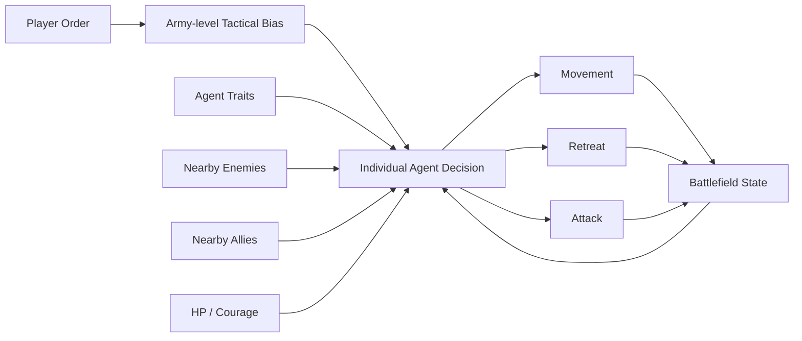
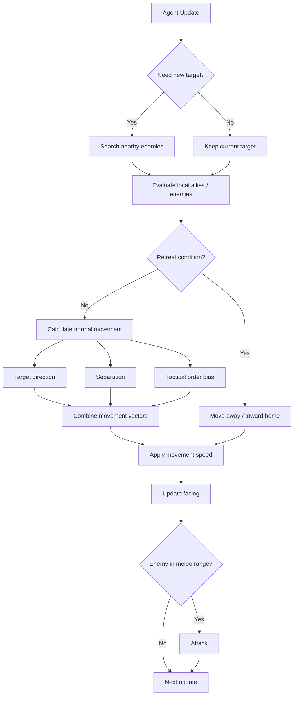
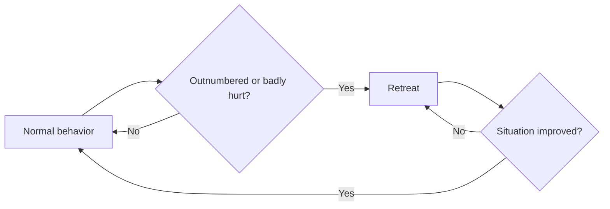
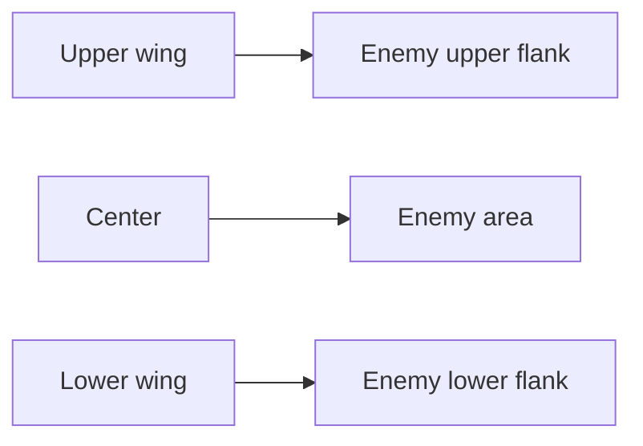
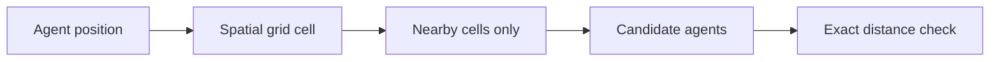
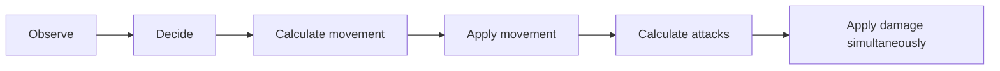
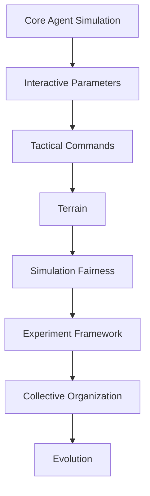
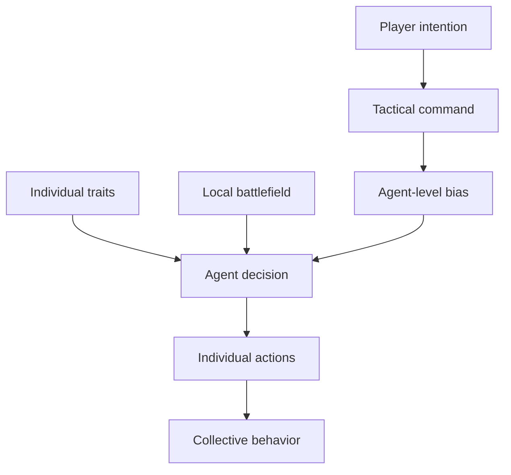

# AlifeBattle

AlifeBattle is a real-time artificial-life-style battle simulation written in Python and Pygame.

Thousands of autonomous agents fight using individual traits and local information. The player does not directly control individual soldiers. Instead, the player gives temporary tactical orders such as **Center Break**, **Encircle**, **Charge**, and **Defense**, while each agent continues making its own decisions.

> **Core idea:** Influence autonomous agents rather than directly controlling them.

## Screenshot


The main screen consists of:

| Area         | Purpose                                   |
| ------------ | ----------------------------------------- |
| Left panel   | RED army parameters and tactical orders   |
| Center       | Real-time battlefield                     |
| Right panel  | BLUE army parameters and tactical orders  |
| Bottom panel | Common simulation parameters and controls |

## How It Works



The player provides a high-level intention, but the final behavior emerges from individual decisions.

For example:

```text
Player issues ENCIRCLE
        ↓
Flank movement bias is added
        ↓
Each agent still reacts independently to:
- nearby enemies
- nearby allies
- health
- courage
- separation
- current target
        ↓
Collective movement emerges
```

## Current Features

| Category         | Features                                                   |
| ---------------- | ---------------------------------------------------------- |
| Scale            | 1,000 vs. 1,000 agents by default                          |
| Agent variation  | HP, Speed, Damage, Attack, Perception, Aggression, Courage |
| Perception       | Local enemy search                                         |
| Movement         | Target pursuit, separation, tactical movement bias         |
| Combat           | Melee attacks and attack cooldown                          |
| Defense          | Front / side / rear damage differences                     |
| Retreat          | Based on local numerical disadvantage and HP               |
| Commands         | Left Advance, Right Advance, Center Break, Encircle        |
| Stances          | Charge, Defense                                            |
| Command duration | Temporary tactical orders                                  |
| Configuration    | Independent RED / BLUE parameters                          |
| Performance      | Spatial grid for nearby-agent searches                     |

## Agent Model

Each soldier is an independent `Agent`.

Each agent receives randomly generated traits when the battle starts.

| Trait      | Meaning                             |
| ---------- | ----------------------------------- |
| HP         | Maximum health                      |
| Speed      | Movement speed                      |
| Damage     | Base attack damage                  |
| Attack     | Time between attacks                |
| Perception | Enemy detection range               |
| Aggression | Strength of forward/target movement |
| Courage    | Resistance to retreat               |

The GUI defines each trait using:

```text
center
width
```

The generated range is:

```text
minimum = center - width / 2
maximum = center + width / 2
```

Example:

```text
HP center = 100
HP width  = 40

→ Random HP range = 80–120
```

Each agent samples its value independently from that range.

## Agent Decision Flow



## Local Behavior

### Target Acquisition

Agents periodically search for the nearest living enemy inside their own perception radius.

Target searches are staggered to avoid all agents performing expensive searches in the same frame.

### Separation

Nearby agents repel each other.

This prevents the entire army from collapsing into a single point and helps create more natural-looking formations.

### Local Force Balance

Each agent counts nearby allies and enemies inside the configured `Local balance` radius.

This influences retreat decisions.

### Retreat

An agent may retreat when:

* nearby enemies greatly outnumber nearby allies
* courage is low
* HP becomes sufficiently low

Retreat overrides maneuver commands.



Retreat is currently recalculated continuously rather than implemented as a persistent state machine.

## Facing and Directional Damage

Each agent has a `forward` direction.

The direction:

* initially faces the enemy
* follows the actual movement direction
* remains unchanged while stationary
* controls triangle orientation
* is used for directional damage calculation

### Damage Direction

| Incoming attack | Damage multiplier |
| --------------- | ----------------: |
| Front           |              0.5× |
| Side            |              1.0× |
| Rear            |              1.5× |

Therefore attacking from behind is significantly more effective than attacking from the front.

Base damage also includes random variation:

```text
0.82× – 1.18×
```

Conceptually:

```text
Final damage
=
Agent damage
× random variation
× attacker stance
× defender stance
× directional multiplier
```

## Tactical Orders

The player can independently command RED and BLUE during battle.

There are two independent command categories:

```text
Maneuver
+
Combat Stance
```

One maneuver and one stance may be active simultaneously.

Example:

```text
RED ARMY

Maneuver: ENCIRCLE
Stance: CHARGE
```

## Maneuver Commands

| Command       | Target             | Effect                               |
| ------------- | ------------------ | ------------------------------------ |
| LEFT ADVANCE  | Left wing          | Stronger forward bias + 10% speed    |
| RIGHT ADVANCE | Right wing         | Stronger forward bias + 10% speed    |
| CENTER BREAK  | Center             | Strong breakthrough bias + 10% speed |
| ENCIRCLE      | Upper/lower groups | Movement toward enemy flanks         |

### LEFT ADVANCE

LEFT is defined from the army's perspective.

```text
RED faces →

screen top    = RED left wing
screen bottom = RED right wing
```

For BLUE:

```text
BLUE faces ←

screen top    = BLUE right wing
screen bottom = BLUE left wing
```

### CENTER BREAK

Agents near the army's vertical center receive:

* stronger enemy-directed movement
* additional aggression-based forward bias
* temporary 10% movement-speed bonus

### ENCIRCLE

ENCIRCLE directs:

```text
upper agents → enemy upper flank
lower agents → enemy lower flank
```



ENCIRCLE currently changes movement direction but does not increase movement speed.

The command is a **bias**, not direct position control.

## Combat Stances

| Stance  | Outgoing Damage | Incoming Damage | Character         |
| ------- | --------------: | --------------: | ----------------- |
| NORMAL  |           1.00× |           1.00× | Balanced          |
| CHARGE  |           1.25× |           1.20× | High-risk offense |
| DEFENSE |           0.80× |           0.75× | Defensive         |

### CHARGE

```text
Attack ↑
Defense ↓
```

Useful when attempting to break an enemy line quickly.

### DEFENSE

```text
Attack ↓
Defense ↑
```

Useful when trying to survive or hold the current battle state.

## Timed Commands

Commands are temporary.

Current configuration:

```python
TACTICAL_TURN_SECONDS = 1.0
ORDER_DURATION_TURNS = 10.0
```

Therefore:

```text
1 tactical turn = 1 simulation second
1 order = 10 tactical turns
```

The side panels show the active order and remaining duration.

Example:

```text
ACTIVE ORDERS
ENCIRCLE [7.3]
CHARGE   [4.8]
```

When the timer reaches zero, the command automatically returns to `NORMAL`.

### Command Replacement

Issuing another maneuver replaces the current maneuver.

```text
ENCIRCLE [4.2]
↓
CENTER BREAK
↓
CENTER BREAK [10.0]
```

Stances behave independently in the same way.

## Simulation Speed

Order duration follows **simulation time**, not real-world time.

| SIM_SPEED | Approximate real duration of a 10-turn command |
| --------: | ---------------------------------------------: |
|      0.5× |                                     20 seconds |
|      1.0× |                                     10 seconds |
|      2.0× |                                      5 seconds |
|      4.0× |                                    2.5 seconds |

When paused, command timers also stop.

## Movement Speed Calculation

Maneuver commands do not permanently modify the agent's original speed.

Currently:

```text
effective speed
=
agent speed
× maneuver multiplier
```

For LEFT ADVANCE, RIGHT ADVANCE, and CENTER BREAK:

```text
maneuver multiplier = 1.10
```

This structure is intentionally designed so that future terrain can be integrated naturally:

```text
effective speed
=
agent speed
× maneuver multiplier
× terrain multiplier
```

## Spatial Grid

A naive simulation could require every agent to compare itself with every other agent.

For 2,000 agents:

```text
2,000 × 2,000
≈ 4,000,000 possible pair checks
```

AlifeBattle instead divides the battlefield into grid cells.



The spatial grid is currently used for:

* target acquisition
* local force-balance calculation
* separation

## User Interface

### RED / BLUE Panels

Each army can independently configure:

| Parameter       | Editable |
| --------------- | -------- |
| Team size       | Yes      |
| HP              | Yes      |
| Speed           | Yes      |
| Damage          | Yes      |
| Attack interval | Yes      |
| Perception      | Yes      |
| Aggression      | Yes      |
| Courage         | Yes      |

The panels also contain tactical command buttons and current command status.

### Common Parameters

| Parameter     | Meaning                             |
| ------------- | ----------------------------------- |
| Cell size     | Spatial-grid resolution             |
| Separation    | Personal-space radius               |
| Melee range   | Attack range                        |
| Local balance | Radius used to count allies/enemies |

Changes take effect through:

```text
APPLY + RESET
```

Existing agents are regenerated with the new values.

## Controls

| Input            | Action                      |
| ---------------- | --------------------------- |
| Space            | Pause / resume              |
| R                | Reset battle                |
| G                | Toggle spatial grid         |
| +                | Increase simulation speed   |
| -                | Decrease simulation speed   |
| Esc              | Exit                        |
| PAUSE / PLAY     | Mouse pause control         |
| RESET            | Restart battle              |
| GRID             | Toggle grid                 |
| APPLY + RESET    | Apply configuration changes |
| Tactical buttons | Issue army commands         |

## Requirements

Recommended environment:

* Python 3.12 or 3.13
* Pygame

Install dependencies:

```bash
python -m pip install -r requirements.txt
```

## Running

Create a virtual environment:

```powershell
py -3.13 -m venv .venv
.\.venv\Scripts\Activate.ps1
```

Install dependencies:

```powershell
python -m pip install -r requirements.txt
```

Run:

```powershell
python alife_battle.py
```

## Repository Structure

Recommended current structure:

```text
AlifeBattle/
├─ alife_battle.py
├─ README.md
├─ requirements.txt
├─ .gitignore
├─ .gitattributes
├─ assets/
│  └─ screenshots/
│     └─ main_battle.png
└─ docs/
   └─ Design.md
```

## Adding a Screenshot

1. Start AlifeBattle.
2. Configure the battle so that agents and tactical controls are clearly visible.
3. Capture the complete application window.
4. Crop unnecessary desktop areas.
5. Save the image as:

```text
assets/screenshots/main_battle.png
```

6. Commit the image to Git:

```bash
git add assets/screenshots/main_battle.png
git add README.md
git commit -m "Add AlifeBattle screenshot"
```

The README displays it using:

```markdown

```

For future screenshots, use descriptive filenames:

```text
assets/screenshots/
├─ main_battle.png
├─ encircle_order.png
├─ center_break.png
└─ parameter_panel.png
```

Additional images can then be embedded with:

```markdown

```

## Future Terrain System

The old impassable-obstacle concept has been removed.

Future versions are planned to introduce terrain such as:

| Terrain     | Possible Effects              |
| ----------- | ----------------------------- |
| High ground | Combat / visibility advantage |
| Low ground  | Potential disadvantage        |
| Forest      | Reduced speed and perception  |
| River       | Large movement penalty        |
| Plain       | Normal movement               |

Terrain should generally modify movement cost rather than simply prohibit entry.

Example:

```text
Plain  → speed ×1.00
Forest → speed ×0.70
River  → speed ×0.50
```

Possible future calculation:

```text
effective speed
=
base speed
× maneuver multiplier
× terrain multiplier
```

## Current Limitations

### Sequential Agent Updates

Agents are currently updated sequentially.

Because RED agents are created first, RED and BLUE do not yet have perfectly simultaneous updates.

Conceptually, the current model is closer to:

```text
RED agent updates
↓
state changes immediately
↓
BLUE agent later observes changed state
```

This may introduce simulation-order bias.

A future staged update system could use:



### Global Enemy-Center Knowledge

Agents without local targets currently know the approximate center of the enemy army.

This is a deliberate simplification and means the simulation is not yet based purely on local information.

### Retreat Has No Persistent State

Retreat is recalculated every update.

Future versions may introduce:

```text
ADVANCE
FIGHT
RETREAT
RECOVER
ROUT
```

### Simple Encirclement

ENCIRCLE currently applies flank-directed movement bias.

It does not yet provide:

* explicit squads
* coordinated waypoints
* command hierarchy
* route planning
* persistent flank groups

Actual encirclement must still emerge from local interactions.

## Development Roadmap



### Implemented

* large autonomous populations
* individual traits
* local perception
* melee combat
* retreat
* directional damage
* configurable RED / BLUE armies
* spatial grid
* tactical commands
* tactical stances
* timed commands

### Next

* terrain and movement costs
* improved tactical behaviors
* RED/BLUE fairness measurement
* simultaneous/staged updates
* automated repeated battles
* statistics and experiment export

### Longer Term

* morale
* squads
* commanders
* information sharing
* different unit types
* evolutionary algorithms
* behavioral evolution

## Core Design Principle

AlifeBattle distinguishes between **command** and **control**.

The player gives commands:

```text
"Advance the left wing."
"Break through the center."
"Encircle."
"Charge."
```

But the player does not directly decide:

```text
Agent #128 moves to (413, 221).
```

Each agent still determines its own behavior.



The aim is for military-looking behavior to arise from the interaction between:

* individual differences
* local information
* player commands
* environmental constraints

## Research Question

> Can recognizable military behavior emerge from simple local rules, individual variation, limited strategic commands, and environmental constraints?

AlifeBattle is intended to develop into both a playable simulation and a small experimental platform for:

* artificial life
* agent-based simulation
* emergent behavior
* complex systems
* evolutionary computation
